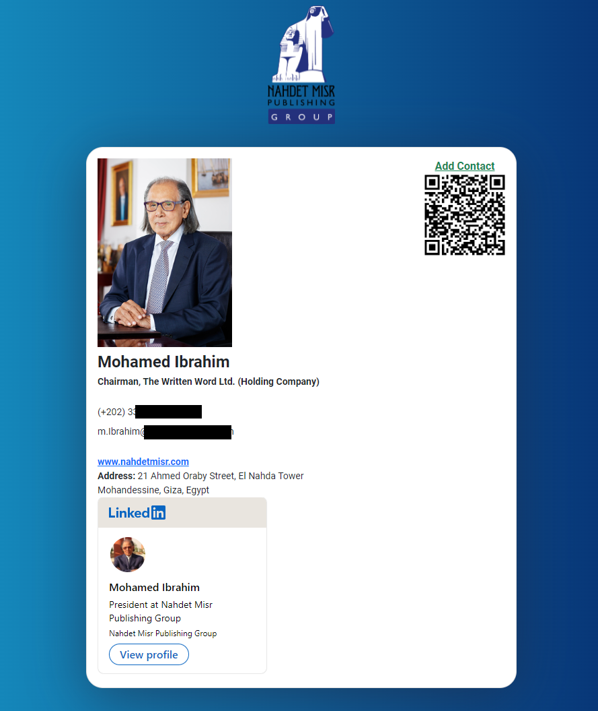

# Digital Bussiness Cards #
### Nahdet Misr AI, heraqi@aucegypt.edu ###

**Steps to generate or editing Digital Cards for employee number number 5 for example (you can do that on multiple employees at once):**

1. Generate the QR code that will be printed with on the physical card:
	1. Visit this website or similar QR code generator websites: https://www.logodesign.net/qrcode-generator (You can use this front color which represents the company identity #24317E and add/or the company logo image, it can be found at assets\images\logo\logo.png)
	2. Add this link/URL: https://rawcdn.githack.com/heshameraqi/bussiness-cards-nahdetmisr/main/card.html?employee_number=5 and generate the QR to be printed (Please note to change 5.html according to the employee number)
2. Verify the information for employee number 5 in present in row number 5 in Business Cards.CSV file in data folder (You can open it was any Excel or any text editor as Notepad). The employeee data items are separated with ; symbol, it should look like this: Name ; emails ; position and company ; phones ; LinkedIn account name
3. Add a jpg personal photo for the employee named 5.jpg of the employee to the photos folder.
4. Create or edit the data in X-vcard.vcf file in the folder vcards (You can open it was any text editor as Notepad)

(This repository is for developers who are willing to continue development or changes to this project: https://github.com/heshameraqi/bussiness-cards-nahdetmisr)

